# User Bridge v. 062625 "Elm"

(Repo created 062625. Going with tree names for versions or repo variations)


>"A centralized authentication service that enables seamless identity sharing between independent business applications." 

User Bridge is a centralized auth service that provides an (optionally) shared user system for two or more separate, related business applications.  One could call it "federated-authentication-service" or "a microservice for a user system & related authentication", but "user-bridge" is more concise and approachable.


## Try it out

```bash
git clone git@github.com:pmeaney/user-bridge.git
cd user-bridge

# Copy the env vars example into the .env file
# NOTE: Be sure to generate a JWT_SECRET (e.g. `openssl rand -base64 32`) and make sure it is in .env after you run this copy command:
cp .env-example .env
docker compose up
# open another terminal to run tests: Unit Tests
docker compose exec api-user-bridge sh -c "pnpm test"
# open another terminal to run tests: End to End Tests
docker compose exec api-user-bridge sh -c "pnpm test:e2e"
```

## Architecture: Unified Identity with Application-Specific Memberships

User Bridge creates a unified identity system across multiple applications while keeping application-specific data separate. 

This architecture makes it easier to manage projects where users can access multiple related services (For example, a user from SaaS 1 can seamlessly review, join, and then access SaaS 2).  It solves a common challenge in multi-application ecosystems: how to provide seamless user experiences without duplicating user data or creating complex cross-application links.

Goals:
- A single source of truth for user identities
- Clear separation between identity and application data
- Flexibility to add more apps in the future
- Proper role and permission management across applications

When a user registers or logs in to one of the apps, this system:

- Creates or verifies their identity in the Auth service
- Creates/updates their app membership
- Returns appropriate tokens

```mermaid
flowchart TD
    subgraph UB["🔐 User-Bridge Auth Microservice"]
        
        subgraph SharedCore["Shared Core Infrastructure"]
            Users[👥 Users Database]
            Auth[🔐 Authentication Logic]
            Memberships[🎫 App Memberships]
            Roles[👑 Roles & Permissions]
        end
        
        subgraph InternalClient["Internal Auth Client"]
            SSO[🔄 SSO Provider]
            Sessions[🍪 Session Management]
            DirectLogin[🚪 Direct Login]
        end
        
        subgraph OAuth2Server["OAuth2 Server Components"]
            Clients[📋 OAuth2 Client Registry]
            Codes[🎟️ Auth Codes]
            Tokens[🔑 Access Tokens]
        end
        
        %% Dependencies within User-Bridge
        SharedCore --> InternalClient
        InternalClient --> OAuth2Server
    end
    
    subgraph Internal["Internal Apps"]
        App1[🏢 Internal SaaS 1]
        App2[🏢 Internal SaaS 2] 
        App3[🏢 Internal SaaS 3]
    end
    
    subgraph ThirdParty["3rd Party Integrated Apps"]
        Flarum[💬 Flarum Forum]
        Nextcloud[☁️ Nextcloud]
        Other[⚡ Other OSS Apps]
    end
    
    %% Internal Auth Flow
    InternalClient --> Internal
    
    %% OAuth2 Flow for Third-Party Apps
    OAuth2Server --> ThirdParty
```




