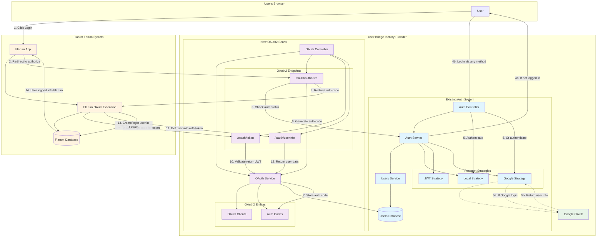

```mermaid
graph TB
    subgraph Browser["User's Browser"]
        U[User]
    end

    subgraph Flarum["Flarum Forum System"]
        F[Flarum App]
        FO[Flarum OAuth Extension]
        FDB[(Flarum Database)]
        F --> FO
        FO --> FDB
    end

    subgraph UserBridge["User Bridge Identity Provider"]
        subgraph ExistingAuth["Existing Auth System"]
            AC[Auth Controller]
            AS[Auth Service]
            US[Users Service]
            UDB[(Users Database)]
            
            subgraph Strategies["Passport Strategies"]
                PS1[Local Strategy]
                PS2[JWT Strategy] 
                PS3[Google Strategy]
            end
            
            AC --> AS
            AS --> US
            AS --> PS1
            AS --> PS2
            AS --> PS3
            US --> UDB
        end
        
        subgraph OAuth2["New OAuth2 Server"]
            OC[OAuth Controller]
            OS[OAuth Service]
            
            subgraph Entities["OAuth2 Entities"]
                OCE[OAuth Clients]
                OAC[Auth Codes]
            end
            
            subgraph Endpoints["OAuth2 Endpoints"]
                E1["/oauth/authorize"]
                E2["/oauth/token"]
                E3["/oauth/userinfo"]
            end
            
            OC --> OS
            OC --> E1
            OC --> E2
            OC --> E3
            OS --> OCE
            OS --> OAC
            OS --> UDB
        end
        
        PS3 -.-> G[Google OAuth]
    end

    %% OAuth2 Flow Steps
    U -->|1. Click Login| F
    F -->|2. Redirect to authorize| E1
    E1 -->|3. Check auth status| AS
    AS -->|4a. If not logged in| U
    U -->|4b. Login via any method| AC
    AC -->|5. Authenticate| PS1
    AC -->|5. Or authenticate| PS3
    PS3 -.->|5a. If Google login| G
    G -.->|5b. Return user info| PS3
    E1 -->|6. Generate auth code| OS
    OS -->|7. Store auth code| OAC
    E1 -->|8. Redirect with code| FO
    FO -->|9. Exchange code for token| E2
    E2 -->|10. Validate return JWT| OS
    FO -->|11. Get user info with token| E3
    E3 -->|12. Return user data| OS
    FO -->|13. Create/login user in Flarum| FDB
    FDB -->|14. User logged into Flarum| F

    %% Styling
    classDef userBridge fill:#e1f5fe
    classDef flarum fill:#fff3e0
    classDef oauth fill:#f3e5f5
    classDef external fill:#e8f5e8
    
    class AC,AS,US,UDB,PS1,PS2,PS3 userBridge
    class OC,OS,OCE,OAC,E1,E2,E3 oauth
    class F,FO,FDB flarum
    class G external
```