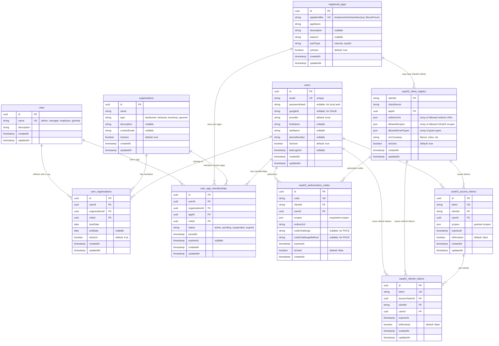

```mermaid
erDiagram
    %% Existing Tables (users module)
    users {
        uuid id PK
        string email UK "unique"
        string passwordHash "nullable, for local auth"
        string googleId "nullable, for OAuth"
        string provider "default: local"
        string firstName "nullable"
        string lastName "nullable"
        string phoneNumber "nullable"
        boolean isActive "default: true"
        timestamp lastLoginAt "nullable"
        timestamp createdAt
        timestamp updatedAt
    }

    %% New OAuth2 Tables
    roles {
        uuid id PK
        string name UK "admin, manager, employee, general"
        string description
        timestamp createdAt
        timestamp updatedAt
    }

    organizations {
        uuid id PK
        string name
        string type "landowner, landuser, business, general"
        string description "nullable"
        string contactEmail "nullable"
        boolean isActive "default: true"
        timestamp createdAt
        timestamp updatedAt
    }

    user_organizations {
        uuid id PK
        uuid userId FK
        uuid organizationId FK
        uuid roleId FK
        date startDate
        date endDate "nullable"
        boolean isActive "default: true"
        timestamp createdAt
        timestamp updatedAt
    }

    registered_apps {
        uuid id PK
        string appIdentifier UK "landownerAndUserdirectory, flarumForum"
        string appName
        string description "nullable"
        string baseUrl "nullable"
        string authType "internal, oauth2"
        boolean isActive "default: true"
        timestamp createdAt
        timestamp updatedAt
    }

    user_app_memberships {
        uuid id PK
        uuid userId FK
        uuid organizationId FK
        uuid appId FK
        uuid roleId FK
        string status "active, pending, suspended, expired"
        timestamp joinedAt
        timestamp expiresAt "nullable"
        timestamp createdAt
        timestamp updatedAt
    }

    oauth2_client_registry {
        string clientId PK
        string clientSecret
        uuid appId FK
        json redirectUris "array of allowed redirect URIs"
        json allowedScopes "array of allowed OAuth2 scopes"
        json allowedGrantTypes "array of grant types"
        string srcCompany "flarum, odoo, etc"
        boolean isActive "default: true"
        timestamp createdAt
        timestamp updatedAt
    }

    oauth2_authorization_codes {
        uuid id PK
        string code UK
        string clientId FK
        uuid userId FK
        json scopes "requested scopes"
        string redirectUri
        string codeChallenge "nullable, for PKCE"
        string codeChallengeMethod "nullable, for PKCE"
        timestamp expiresAt
        boolean isUsed "default: false"
        timestamp createdAt
    }

    oauth2_access_tokens {
        uuid id PK
        string token UK
        string clientId FK
        uuid userId FK
        json scopes "granted scopes"
        timestamp expiresAt
        boolean isRevoked "default: false"
        timestamp createdAt
        timestamp updatedAt
    }

    oauth2_refresh_tokens {
        uuid id PK
        string token UK
        uuid accessTokenId FK
        string clientId FK
        uuid userId FK
        timestamp expiresAt
        boolean isRevoked "default: false"
        timestamp createdAt
        timestamp updatedAt
    }

    %% Relationships
    users ||--o{ user_organizations : "belongs to"
    organizations ||--o{ user_organizations : "has members"
    roles ||--o{ user_organizations : "defines role in org"
    
    users ||--o{ user_app_memberships : "has memberships"
    organizations ||--o{ user_app_memberships : "members access apps"
    registered_apps ||--o{ user_app_memberships : "users join apps"
    roles ||--o{ user_app_memberships : "role in app"
    
    registered_apps ||--o{ oauth2_client_registry : "may have OAuth2 clients"
    
    oauth2_client_registry ||--o{ oauth2_authorization_codes : "generates codes"
    users ||--o{ oauth2_authorization_codes : "authorizes"
    
    oauth2_client_registry ||--o{ oauth2_access_tokens : "issues tokens"
    users ||--o{ oauth2_access_tokens : "owns tokens"
    
    oauth2_access_tokens ||--o{ oauth2_refresh_tokens : "can refresh"
    oauth2_client_registry ||--o{ oauth2_refresh_tokens : "issues refresh tokens"
    users ||--o{ oauth2_refresh_tokens : "owns refresh tokens"
```