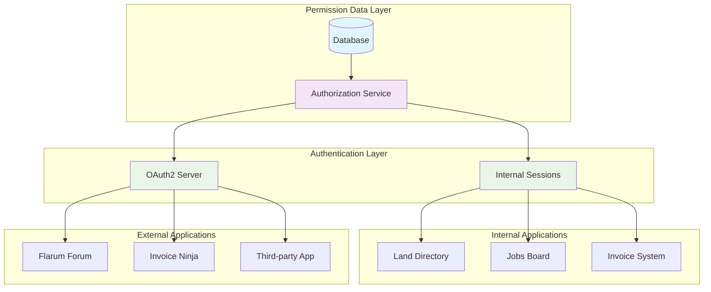
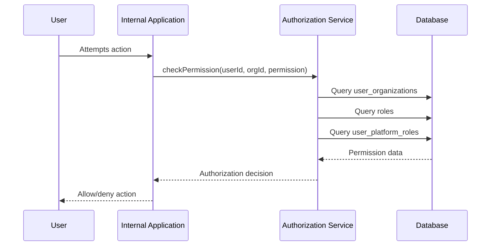
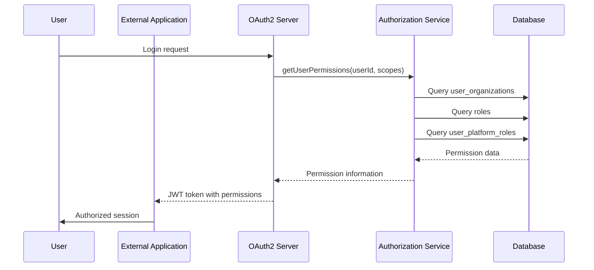
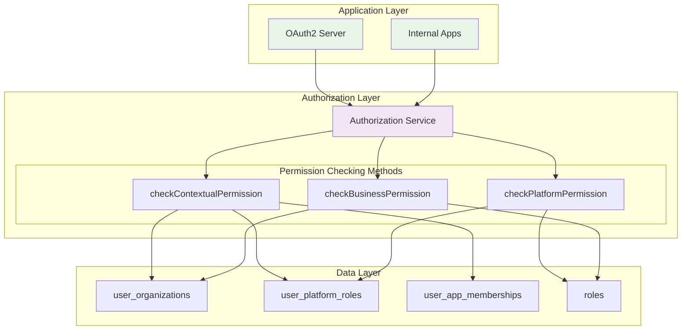

# Application-Agnostic Permission Architecture: Unified Authorization for Internal and OAuth2 Applications

## Introduction

When designing authentication and authorization systems for modern platforms, software engineers often face a fundamental architectural question: Should internal applications and external OAuth2 clients use different permission models? The answer, perhaps counterintuitively, is that the most robust and maintainable approach treats both application types as equal consumers of a unified permission system.

This document examines how to design database schemas and authorization architectures that serve both internal applications and external OAuth2 clients from a single source of truth, eliminating permission drift and ensuring consistent user experiences across your entire platform ecosystem.

## The Core Architectural Principle

The fundamental insight driving this approach is the recognition that **authorization questions are application-agnostic**. Whether a user is accessing your internal land directory or an external forum application integrated via OAuth2, the underlying question remains the same: "What is this user authorized to do in this context?"

The mechanism for delivering authorization information differs between internal and external applications, but the permission evaluation logic, the underlying data model, and the business rules governing access control should remain identical across your entire platform.



## Database Design Philosophy: Application-Agnostic Foundations

### Organizational Relationships Independent of Application Context

Consider how the user_organizations table captures organizational relationships without any reference to specific applications. This design choice reflects the understanding that a user's relationship with an organization exists as a fundamental fact about their identity within your platform, regardless of how applications learn about this relationship.

**User Organizations Table:**
| id    | userId   | organizationId   | roleId      | title                     | startDate  | isActive |
|-------|----------|------------------|-------------|---------------------------|------------|----------|
| uo-01 | user-001 | org-happy-acre   | role-b-adm  | Farm Owner                | 2023-01-01 | true     |
| uo-02 | user-003 | org-happy-acre   | role-b-gen  | Community Member          | 2023-01-01 | true     |
| uo-03 | user-003 | org-jims-cattle  | role-b-wrk  | Sustainability Consultant | 2023-03-15 | true     |
| uo-04 | user-003 | org-agricorp     | role-b-adm  | CEO                       | 2022-01-01 | true     |

When Lisa Chen (user-003) has an admin role at AgriCorp Solutions, that relationship exists as an immutable fact about her platform identity. Your internal applications can query this relationship directly through your authorization service to determine her business authority. Simultaneously, your OAuth2 server can package this same relationship information into JWT tokens for external applications like Invoice Ninja or Flarum.

The organizational relationship itself remains completely independent of how applications discover and utilize this information, creating a clean separation between identity data and application integration patterns.

### Business vs Platform Role Separation

The roles table demonstrates another application-agnostic design principle by separating business authority from platform governance without regard to where these roles might be exercised.

**Roles Table:**
| id          | name        | category | scope    | description                           | permissions                                   |
|-------------|-------------|----------|----------|---------------------------------------|-----------------------------------------------|
| role-b-adm  | admin       | business | business | Full authority within organization    | ["manage_org", "staff_mgmt", "finances", "manage_ops"] |
| role-b-mgr  | manager     | business | business | Operational management                | ["manage_ops", "view_reports", "view_basic_info"] |
| role-p-mod  | moderator   | platform | system   | Community moderation authority        | ["view_content", "create_content", "moderate_content"] |
| role-p-con  | contributor | platform | system   | Enhanced content creation             | ["view_content", "create_content"] |

Notice how business roles define organizational authority in terms that apply equally to any application requiring business permission validation. A business admin role represents organizational control whether that authority is being exercised through your internal land directory, your internal jobs board, or an external invoice management system integrated via OAuth2.

Similarly, platform roles define community governance authority without assumptions about implementation details. A moderator role grants content moderation capabilities whether those capabilities are exercised through internal moderation interfaces or external forum applications.

## The Application Bridge: User App Memberships

The user_app_memberships table serves as the critical bridge between users and applications, demonstrating how authorization information can support both internal and external application scenarios through a unified data model.

**Lisa's Initial User App Memberships (Community Volunteer Phase):**
| id     | userId   | organizationId  | appId       | businessRoleId | platformRoleId | status |
|--------|----------|-----------------|-------------|----------------|----------------|--------|
| uam-06 | user-003 | org-happy-acre  | app-forum   | role-b-gen     | role-p-mod     | active |
| uam-08 | user-003 | org-jims-cattle | app-forum   | role-b-wrk     | role-p-mod     | active |
| uam-09 | user-003 | org-agricorp    | app-land    | role-b-adm     | null           | active |
| uam-10 | user-003 | org-agricorp    | app-invoice | role-b-adm     | null           | active |

This table structure enables sophisticated authorization scenarios that work identically for internal and external applications. When Lisa Chen accesses the forum representing Happy Acre Farms, she has general business authority (role-b-gen) combined with platform moderation authority (role-p-mod). When she accesses the same forum representing Jim's Cattle Ranch, she has worker business authority (role-b-wrk) but identical platform moderation authority.

The above situation demonstrates Lisa working at a customer farm while simultaneously serving as a volunteer community moderator promoted by SaaS staff. However, the permission architecture supports even more sophisticated career progression scenarios that reflect how agricultural technology platforms naturally evolve.

Now imagine Lisa has been hired as a part-time employee by Teravi itself. In this evolved scenario, Lisa maintains all her existing relationships - she remains a farm owner at Happy Acre Farms, continues her consulting work at Jim's Cattle Ranch, and preserves her CEO role at AgriCorp Solutions. However, she also gains new professional responsibilities as a Teravi SaaS employee. 

The system accommodates this transition by creating an organization entry for Teravi (org-teravi) and establishing Lisa's employment relationship with a business role that grants her professional content management authority. Her elevated status transforms her from customer-level community moderation to SaaS-employee-level content management across multiple platform areas.

**Lisa's Expanded User App Memberships (Teravi Employee Phase):**
| id     | userId   | organizationId  | appId       | businessRoleId | platformRoleId | status |
|--------|----------|-----------------|-------------|----------------|----------------|--------|
| uam-06 | user-003 | org-happy-acre  | app-forum   | role-b-gen     | role-p-mod     | active |
| uam-08 | user-003 | org-jims-cattle | app-forum   | role-b-wrk     | role-p-mod     | active |
| uam-09 | user-003 | org-agricorp    | app-land    | role-b-adm     | null           | active |
| uam-10 | user-003 | org-agricorp    | app-invoice | role-b-adm     | null           | active |
| uam-15 | user-003 | org-teravi      | app-forum   | role-b-mgr     | role-p-mod     | active |
| uam-16 | user-003 | org-teravi      | app-jobs    | role-b-mgr     | role-p-mod     | active |

Notice how the new entries (uam-15 and uam-16) establish Lisa's professional relationship with Teravi while preserving all her existing organizational memberships. She now possesses business manager authority when operating as a Teravi employee, combined with platform moderation capabilities that enable her to perform professional content management duties across both forum and jobs board applications.

This architectural flexibility demonstrates how the permission system naturally accommodates organizational evolution and career progression pathways that are common in growing agricultural technology platforms. Lisa's transition from farm owner to community volunteer to professional SaaS employee happens seamlessly within the same authorization framework, with each role transition creating clear audit trails and accountability structures. 

The system maintains careful separation between her historical community contributions and her current professional responsibilities while enabling her to exercise appropriate authority across multiple applications and organizational contexts. When Lisa moderates content as a Teravi employee, the system can distinguish this professional action from her volunteer community moderation, ensuring proper accountability and appeal processes for each type of authority.

As the platform scales and requires more sophisticated content management, trusted community members can transition into professional roles without disrupting existing relationships or requiring fundamental changes to the underlying authorization architecture. The authorization system can answer complex questions like "What are Lisa's capabilities when she accesses the forum representing AgriCorp versus when she's acting as a Teravi employee?" regardless of whether the applications are implemented internally with direct database access or as external services integrated via OAuth2.

## Permission Evaluation Flow Comparison

### Internal Application Authorization Flow



### OAuth2 Application Authorization Flow



Both flows demonstrate how the same authorization service and database queries support different application integration patterns. The internal application receives direct authorization decisions from the service, while the external application receives packaged permission information through JWT tokens. However, both paths consult identical permission data and apply identical business logic.

## Registered Applications: Unified Application Management

The registered_apps table treats internal and external applications as equals within your platform ecosystem, reinforcing the application-agnostic design philosophy.

**Registered Apps Table:**
| id          | appIdentifier              | appName                    | authType | baseUrl                      |
|-------------|----------------------------|----------------------------|----------|------------------------------|
| app-land    | landownerAndUserdirectory  | Land Directory             | internal | https://land.teravi.com      |
| app-forum   | flarumForum                | Community Forum            | oauth2   | https://discuss.teravi.com   |
| app-invoice | invoiceNinja               | Invoice Management         | oauth2   | https://invoice.teravi.com   |
| app-jobs    | ruralJobsBoard             | Rural Jobs Board           | internal | https://jobs.teravi.com      |

An application is simply an application within this model. It has an identifier, requires specific authentication mechanisms, and users have defined roles when accessing it. Whether the application runs on your servers or integrates through OAuth2 becomes an implementation detail that doesn't affect the fundamental authorization relationships captured in user_app_memberships.

## Context-Aware Authorization Examples

### Scenario: Lisa Chen Moderating Forum Content

Consider what happens when Lisa Chen wants to moderate a forum discussion while representing Happy Acre Farms. Both an internal forum system and an external OAuth2-integrated forum need access to identical contextual information.

**Authorization Query Result:**
```json
{
  "userId": "user-003",
  "organizationalContext": {
    "organizationId": "org-happy-acre",
    "organizationName": "Happy Acre Farms",
    "businessRole": "general",
    "businessPermissions": ["view_basic_info"]
  },
  "platformContext": {
    "platformRole": "moderator",
    "platformPermissions": ["view_content", "create_content", "moderate_content"]
  }
}
```

An internal forum application can query the authorization service directly to receive this information and make appropriate interface decisions. An external forum application receives the same information packaged into a JWT token's claims. Both applications can verify that Lisa has platform authority to moderate content while understanding that she's representing Happy Acre Farms in a general member capacity.

### Scenario: Multi-Application Business Authority

When Lisa accesses the invoice management system representing AgriCorp Solutions, the authorization evaluation demonstrates how business permissions apply consistently across application boundaries.

**User App Membership Query:**
| userId   | organizationId | appId       | businessRoleId | platformRoleId |
|----------|----------------|-------------|----------------|----------------|
| user-003 | org-agricorp   | app-invoice | role-b-adm     | null           |

**Business Role Permissions:**
| roleId      | permissions                                           |
|-------------|-------------------------------------------------------|
| role-b-adm  | ["manage_org", "staff_mgmt", "finances", "manage_ops"] |

Whether the invoice system is your internal billing application or an external Invoice Ninja integration, the authorization system confirms that Lisa has business admin authority at AgriCorp, including financial permissions necessary for invoice management. The permission evaluation logic remains identical regardless of application integration approach.

## Implementation Strategies

### Shared Authorization Service Architecture



The authorization service serves as the single source of truth for permission decisions across your entire platform. Internal applications call service methods directly, while your OAuth2 server calls the same methods to determine what information to include in JWT tokens. This architectural approach ensures that authorization logic remains consistent regardless of application integration patterns.

### Database as Single Source of Truth

Your database schema serves as the authoritative source for all authorization decisions across your platform. Whether permissions are being evaluated by internal applications, packaged into OAuth2 tokens, or checked during API access, the definitive information originates from the same tables using identical business logic.

This single source of truth approach prevents authorization drift that commonly occurs in distributed systems where different applications maintain separate copies of permission information. By ensuring that all authorization decisions trace back to the same database tables, you guarantee consistency across your entire platform ecosystem.

## Future-Proofing Through Unified Design

### Permission Evolution Without Application Updates

When you need to add new permission categories or modify existing authorization rules, the unified architecture enables platform-wide updates through centralized changes. Consider adding a new platform permission like "schedule_events" to support community calendar management.

**Updated Role Permissions:**
| roleId      | permissions                                                     |
|-------------|----------------------------------------------------------------|
| role-p-cur  | ["view_content", "create_content", "curate_content", "schedule_events"] |

This permission addition automatically becomes available to both internal applications (through direct authorization service queries) and external applications (through expanded JWT token claims). Individual applications don't require updates to understand the new permission structure because they delegate authorization decisions to your centralized service.

### Ecosystem Expansion Support

The application-agnostic design supports natural ecosystem growth as you add new internal applications or integrate with additional external services. A new logistics coordination application can integrate with your existing authorization infrastructure using the same patterns that your current applications employ.

Similarly, when external partners want to build applications that integrate with your platform through OAuth2, they receive permission information that's consistent with your internal applications' understanding. This consistency ensures that users have predictable experiences regardless of application integration complexity.

## Conclusion

Designing authorization systems that treat internal and external applications as equal consumers of unified permission data creates architectures that are both robust and maintainable. By focusing on application-agnostic database schemas, centralized authorization services, and consistent permission evaluation logic, you can build platforms that support sophisticated integration scenarios while maintaining clear security boundaries and predictable user experiences.

The investment in unified design pays dividends throughout platform development, enabling rapid feature development, confident user onboarding, and seamless ecosystem expansion without requiring fundamental architectural changes or creating permission inconsistencies across application boundaries.

This architectural approach transforms authorization from a constraint on platform growth into an enabler of sophisticated multi-application ecosystems where users can move seamlessly between internal and external services while maintaining consistent access to their organizational authority and platform capabilities.