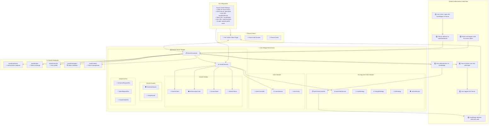

```mermaid
graph TB
    subgraph UserBridge["🔐 User-Bridge Microservice"]
        subgraph ExistingAuth["Existing Auth-Client Module"]
            AuthController[📋 AuthClientController]
            AuthService[⚙️ AuthClientService]
            LocalStrategy[🔑 LocalStrategy]
            GoogleStrategy[🌐 GoogleStrategy]
            JwtStrategy[🎫 JwtStrategy]
            JwtGuard[🛡️ JwtAuthGuard]
        end
        
        subgraph UsersModule["Users Module"]
            UsersController[👥 UsersController]
            UsersService[⚙️ UsersService]
            UserEntity[📄 User Entity]
        end
        
        subgraph NewOAuth2Server["🆕 OAuth2 Server Module"]
            OAuth2Controller[📋 OAuth2Controller]
            OAuth2Service[⚙️ OAuth2Service]
            
            subgraph OAuth2Entities["OAuth2 Entities"]
                ClientEntity[🏢 OAuth2Client]
                CodeEntity[🎟️ AuthorizationCode]
                TokenEntity[🔑 AccessToken]
                RefreshTokenEntity[🔄 RefreshToken]
            end
            
            subgraph OAuth2Guards["OAuth2 Guards"]
                ClientGuard[🛡️ ClientAuthGuard]
                ScopeGuard[🔐 ScopeGuard]
            end
            
            subgraph OAuth2DTOs["OAuth2 DTOs"]
                AuthorizeDTO[📝 AuthorizeRequestDto]
                TokenDTO[📝 TokenRequestDto]
                ClientDTO[📝 CreateClientDto]
            end
        end
        
        %% Dependencies
        OAuth2Service --> UsersService
        OAuth2Service --> AuthService
        OAuth2Controller --> OAuth2Service
        OAuth2Service --> ClientEntity
        OAuth2Service --> CodeEntity
        OAuth2Service --> TokenEntity
        OAuth2Service --> RefreshTokenEntity
    end
    
    subgraph Flarum["💬 Flarum Forum"]
        FoFPlugin[🔌 FoF OAuth Client Plugin]
        FlarumAuth[🔐 Flarum Auth System]
        FlarumUsers[👥 Flarum Users]
    end
    
    subgraph FlowSteps["OAuth2 Authorization Code Flow"]
        Step1[1️⃣ User clicks 'Login with UserBridge' in Flarum]
        Step2[2️⃣ Flarum redirects to /oauth/authorize]
        Step3[3️⃣ User authenticates via UserBridge]
        Step4[4️⃣ UserBridge redirects with auth code]
        Step5[5️⃣ Flarum exchanges code for access token]
        Step6[6️⃣ Flarum fetches user info with token]
        Step7[7️⃣ User logged into Flarum]
    end
    
    %% OAuth2 Flow Connections
    Step1 --> Step2
    Step2 --> OAuth2Controller
    OAuth2Controller --> Step3
    Step3 --> AuthController
    AuthController --> Step4
    Step4 --> FoFPlugin
    Step5 --> OAuth2Controller
    OAuth2Controller --> Step6
    Step6 --> Step7
    
    %% Main Integration
    FoFPlugin <--> OAuth2Controller
    
    subgraph Endpoints["🌐 OAuth2 Endpoints"]
        AuthorizeEndpoint["/oauth/authorize<br/>📍 Authorization endpoint"]
        TokenEndpoint["/oauth/token<br/>🔑 Token exchange"]
        UserInfoEndpoint["/oauth/userinfo<br/>👤 User profile"]
        IntrospectEndpoint["/oauth/introspect<br/>🔍 Token validation"]
        ClientEndpoint["/oauth/clients<br/>🏢 Client management"]
    end
    
    OAuth2Controller --> AuthorizeEndpoint
    OAuth2Controller --> TokenEndpoint
    OAuth2Controller --> UserInfoEndpoint
    OAuth2Controller --> IntrospectEndpoint
    OAuth2Controller --> ClientEndpoint
    
    %% Configuration Flow
    subgraph Config["⚙️ Configuration"]
        FlarumConfig["Flarum OAuth Settings:<br/>• Client ID: flarum-forum<br/>• Client Secret: generated<br/>• Auth URL: /oauth/authorize<br/>• Token URL: /oauth/token<br/>• User URL: /oauth/userinfo<br/>• Scopes: openid profile email"]
    end
    
    Config --> FoFPlugin
    Config --> OAuth2Service
```